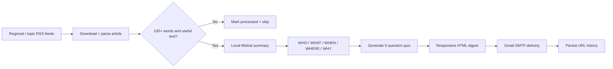

<div align="center">

<sub>Real photography by <a href="https://commons.wikimedia.org/wiki/File:Person_reading_a_newspaper_(Unsplash).jpg">Roman Kraft on Wikimedia Commons (CC0)</a>.</sub>

# CE-I Newsletter
### Four automated news products. Local AI summaries. Built-in knowledge checks.


[System](#system-design) · [Digests](#digest-products) · [Setup](#local-setup) · [Security](#security-required-before-use)
</div>

---

## Overview

CE-I Newsletter is a family of four independent news-intelligence pipelines: general U.S., international, Texas, and cross-topic. Each collector reads multiple RSS publishers, extracts article bodies, rejects thin content, summarizes locally with a Mistral 7B GGUF model, creates five comprehension questions, renders a responsive HTML newsletter, and sends it to a recipient list.

Each product owns a separate processed-URL file and GitHub Actions schedule, allowing its editorial scope and cadence to evolve independently.


## System design



## Digest products

| Script | Editorial scope | State file | Workflow cadence |
|---|---|---|---|
| `main.py` | U.S. general news | `processed_urls.json` | Every 4 hours |
| `intl_main.py` | International regions | `intl_processed_urls.json` | Every 6 hours at `:30` |
| `texas_main.py` | Texas news | `texas_processed_urls.json` | Every 6 hours |
| `topics_main.py` | Politics, business, health, technology | `topics_processed_urls.json` | 00:00, 08:00, 16:00 UTC |

## Intelligence layer

The local model is configured with a 2,048-token context, four CPU threads, a 512 batch size, and all available GPU layers when supported. Article prompts demand labeled factual summaries; the topic variant adds `IMPACT`. A second prompt asks for exactly five four-option MCQs, then line-oriented parsing recovers question, options, and answer fields.

The email renderer groups stories by region/topic, color-codes sections, includes source links and structured summaries, and appends the quiz with answers.

## Local setup

```bash
git clone https://github.com/TanishC4444/CE-I-Newsletter.git
cd CE-I-Newsletter
python -m venv .venv
source .venv/bin/activate
python -m pip install -r requirements.txt
mkdir -p models
```

Place `mistral-7b-instruct-v0.1.Q4_K_M.gguf` at:

```text
models/mistral-7b-instruct-v0.1.Q4_K_M.gguf
```

After completing the security migration, run one product:

```bash
python main.py
# or: python intl_main.py / texas_main.py / topics_main.py
```

## Repository map

```text
CE-I-Newsletter/
├── .github/workflows/        four scheduled digest jobs
├── main.py                   U.S. digest
├── intl_main.py              international digest
├── texas_main.py             Texas digest
├── topics_main.py            topic digest
├── *_processed_urls.json     product-specific durable state
├── rsstester.py              feed experiment
└── requirements.txt
```

## Engineering tradeoffs

| Choice | Strength | Limitation |
|---|---|---|
| Local GGUF inference | Data and generation remain under project control | Model setup is heavy and CPU execution is slow |
| Four scripts | Simple independent scheduling and editorial changes | Significant code duplication |
| JSON URL history | No database required | Multi-megabyte state files and whole-file rewrites |
| Strict output format | Enables deterministic HTML rendering | Generative format drift can drop summaries/questions |
| Mark rejected URLs processed | Avoids retry loops for unusable pages | Temporary extraction failures may never be revisited |

## Skills demonstrated

Multi-source ingestion · local LLM inference · prompt/schema design · content quality gates · email UX · SMTP/TLS · CI scheduling · idempotent state · product segmentation

## Resume-ready highlight

> Built four automated regional/topic news products that ingest RSS content, perform local Mistral-based structured summarization and quiz generation, render responsive HTML newsletters, and maintain independent cross-run deduplication state.

## License

This repository includes an MIT license.

