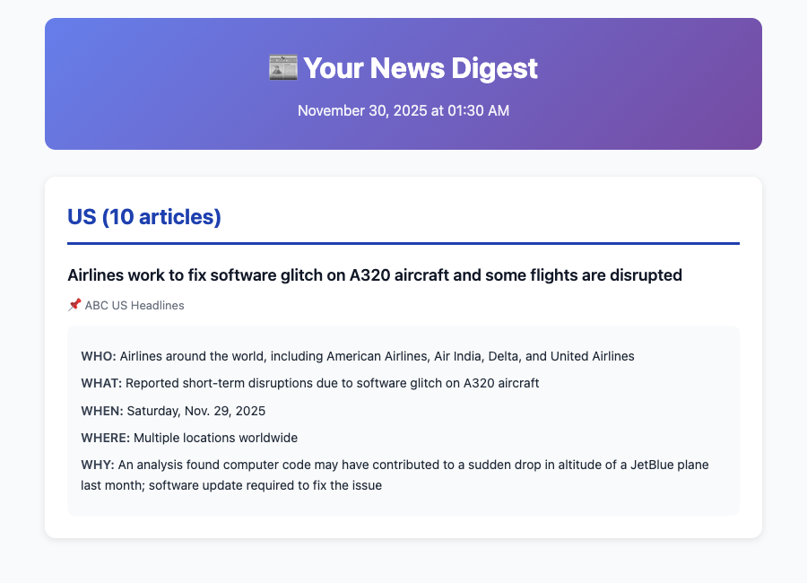
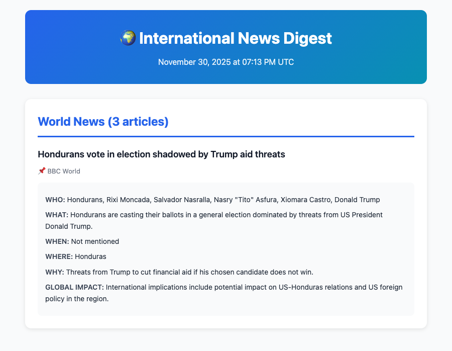
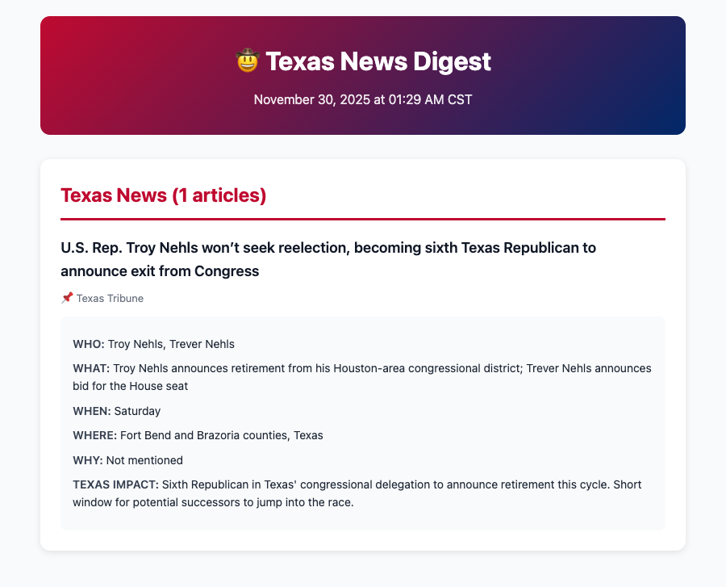
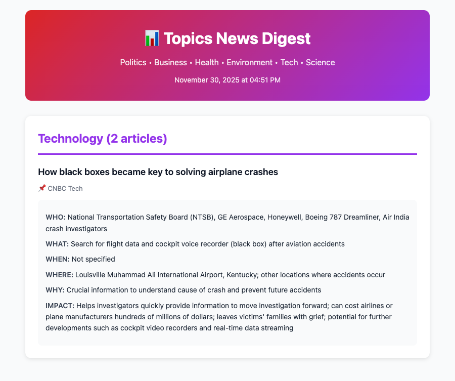
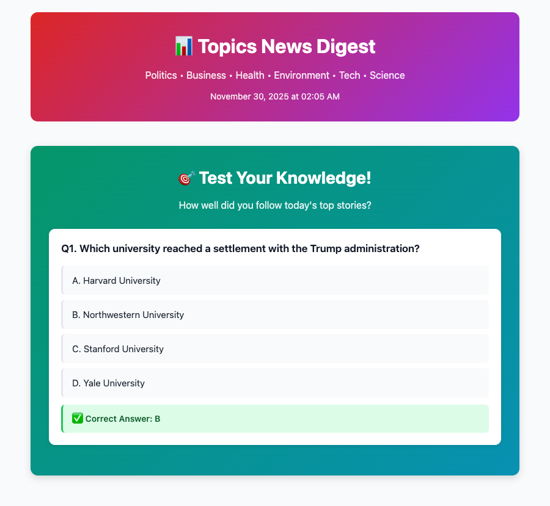

# CE-I Newsletter — Real Email Examples

Four editions, four reading needs: a general briefing, international context, Texas developments, and subject-focused learning. This gallery shows actual received output from [CE-I Newsletter](https://github.com/TanishC4444/CE-I-Newsletter), with one selected story from each edition and a comprehension-question example.

## The four editions

| Edition | What it adds | Selected example | Best use |
| --- | --- | --- | --- |
| General News Digest | WHO / WHAT / WHEN / WHERE / WHY | A320 software disruption | Quickly understand a consequential breaking story |
| International News Digest | Regional sections and GLOBAL IMPACT | Honduras election and foreign-aid pressure | Connect an overseas event to international relations |
| Texas News Digest | Local geography and TEXAS IMPACT | Troy Nehls announces he will not seek reelection | Follow changes affecting Texas representation |
| Topics Digest | Subject sections and IMPACT | Flight recorders and accident investigation | Turn a technical explainer into study notes |

These are the strongest **individual excerpts in the reviewed sample**, chosen for clear structure, substantive subject matter, and useful source attribution. They are not a ranking of every email ever sent. All selected issues are dated November 30, 2025, making the editions easy to compare at the same point in the project's history.

**Screenshot method:** images are browser-rendered excerpts of the original email HTML, not Gmail-interface captures. Each keeps its original masthead, section heading, story text, and styling. Other stories, inbox information, and footers are omitted. Section article counts still refer to the original issue, not the excerpt. The quiz screenshot contains one original question. No generated summary or answer was silently rewritten.

## 1. General News Digest — A320 software disruption

**Issue:** News Digest — 10 New Articles — Nov 30, 2025. **Source shown:** ABC US Headlines.

This is a strong example of the five-part briefing format: it identifies the airlines, describes a software issue, supplies a date, establishes the international scope, and connects the disruption to an earlier aviation incident. It turns a headline into a short explanation a reader can scan.

**Why this story matters:** the underlying event affected real airline operations. Airbus's [November 28 statement](https://www.airbus.com/en/newsroom/press-releases/2025-11-airbus-update-on-a320-family-precautionary-fleet-action) confirms precautionary action after identifying a risk that intense solar radiation could corrupt flight-control data. AirAsia [confirmed completion of the required software rollback on November 30](https://newsroom.airasia.com/news/airasia-has-completed-easa-mandated-requirements-operations-back-to-normal).

**Verification boundary:** those primary sources confirm the event and operational response, not every airline named in the generated summary. The [original ABC link](https://abcnews.go.com/US/wireStory/airlines-work-fix-software-glitch-a320-aircraft-flights-127959850) returned a retrieval error during review. The email's generic “software update” description should be read alongside the operator's more specific rollback explanation.

## 2. International News Digest — Honduras election

**Issue:** International News Digest — 12 New Articles — Nov 30, 2025. **Source shown:** BBC World.

This excerpt demonstrates the international edition's main distinction: **GLOBAL IMPACT** gives the reader a place to consider cross-border implications after identifying the people, event, and country. Its “WHEN: Not mentioned” field also makes an information gap visible instead of supplying a precise date.

**Event check:** contemporary reporting confirms voting in Honduras amid Trump's threat to withhold aid if his preferred candidate lost. [Contemporary report](https://www.theguardian.com/world/2025/nov/30/honduras-vote-election-trump-threat-cut-aid-if-nasry-tito-asfura-loses).

The [original BBC link](https://www.bbc.com/news/articles/cx2dgp8mvmno) is retained, although its body could not be retrieved during this review. The screenshot is a historical election-day briefing, not a statement of the eventual result. Its implications field is generated analysis rather than evidence that a future outcome occurred.

**Why selected:** the story gives the international format a clear purpose: organizing an event with several actors and an explicit foreign-policy dimension.

## 3. Texas News Digest — congressional turnover

**Issue:** Texas News Digest — 1 New Articles — Nov 30, 2025. **Source shown:** Texas Tribune.

This is the clearest local-impact example in the sample. It identifies Troy and Trever Nehls, places the development in Fort Bend and Brazoria counties, and explains the short window for prospective candidates.

The [Texas Tribune report](https://www.texastribune.org/2025/11/29/troy-nehls-retiring-congress-texas-republican-delegation/) confirms Troy's November 29 announcement, Trever's subsequent candidacy announcement, and the December 8 filing deadline. It identifies Troy as the sixth Texas Republican in the congressional delegation to announce he would not seek reelection that cycle.

**Why selected:** the **TEXAS IMPACT** field connects a national-office story to local representation and an approaching deadline. The generated wording “retirement” is shorthand for not seeking reelection; it does not mean he immediately vacated the seat. The listed counties are the district's center, not its complete geographic extent.

## 4. Topics Digest — the role of flight recorders

**Issue:** Topics Digest — 10 New Articles — Nov 30, 2025. **Source shown:** CNBC Tech. **Section:** Technology.

This excerpt shows the topic edition working as a study aid: WHO names relevant organizations, WHAT identifies the devices and investigation process, WHY describes their purpose, and IMPACT provides a place for consequences and future developments.

The [original CNBC article](https://www.cnbc.com/2025/11/30/black-box-airplane-crashes.html) could not be retrieved during review. The NTSB's [flight-recorder explanation](https://www.ntsb.gov/news/Pages/cvr_fdr.aspx) independently supports the central point that cockpit voice and flight data recorders are valuable investigative tools. It does not independently verify all the case-specific names, costs, or predictions in the email.

**Why selected:** a technical explainer demonstrates subject-based learning particularly well. Readers can use the card to identify what to investigate further, then follow the source. The original issue also contains Politics, Business & Economy, and Health & Medicine sections. The masthead advertises Environment and Science, but those are not separate feed groups in the inspected `topics_main.py`.

## Bonus — a usable comprehension question

**Issue:** Topics Digest — 3 New Articles — Nov 30, 2025. **Excerpt:** Question 1 only.

The question asks readers to identify the university involved in a federal settlement. It has four distinct options and a correct answer of **B, Northwestern University**, supported by the university's [November 28 announcement](https://www.northwestern.edu/leadership-notes/2025/agreement-to-restore-federal-funds.html).

**Why selected:** it demonstrates the intended reading-to-recall workflow in one compact, checkable example. It does not validate the rest of that quiz. In fact, the associated generated article summary incorrectly dates the agreement to 2018; the linked university announcement establishes 2025.

## What these examples demonstrate

- Four distinct email products with recognizable visual identities and reading scopes.
- Linked publisher attribution and structured summaries that support quick scanning.
- Edition-specific context through GLOBAL IMPACT, TEXAS IMPACT, and IMPACT fields.
- A built-in path from reading to recall through generated multiple-choice questions.

The inspected workflows schedule general news every four hours, international and Texas every six hours, and topics at 00:00, 08:00, and 16:00 UTC. Those are configured schedules, not measured delivery guarantees. Original displayed timestamps are preserved; the Texas template's CST label is not used here to infer an independently verified receipt time.

## Quality limits observed in the sample

Some other cards had missing summaries, incorrect historical dates, or mismatched details. Some quizzes had missing options, repeated choices, unsupported answers, or truncated output. The selected excerpts show useful capabilities without treating whole issues as verified. In particular, AI-generated quizzes should be checked before using them as scored practice material.

The project is best demonstrated as an automated collection, organization, and study workflow. These examples do not measure improved test scores, comprehensive news coverage, or guaranteed factual accuracy. Publisher links and explicit uncertainty are essential parts of the reading experience.

*Prepared September 8, 2026 from received project emails, the repository's four pipeline scripts, and the linked sources. This Markdown file and its assets live directly under `docs/`.*
